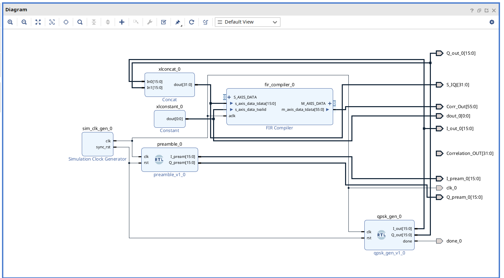
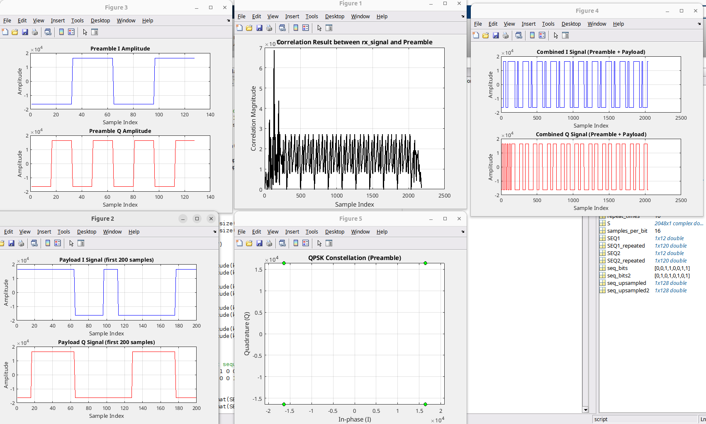
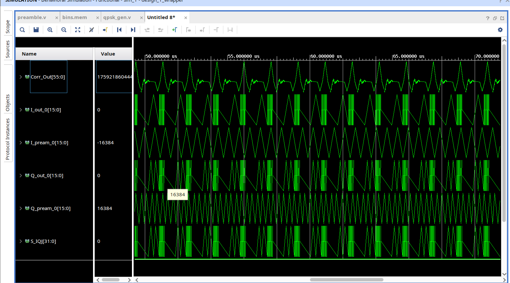
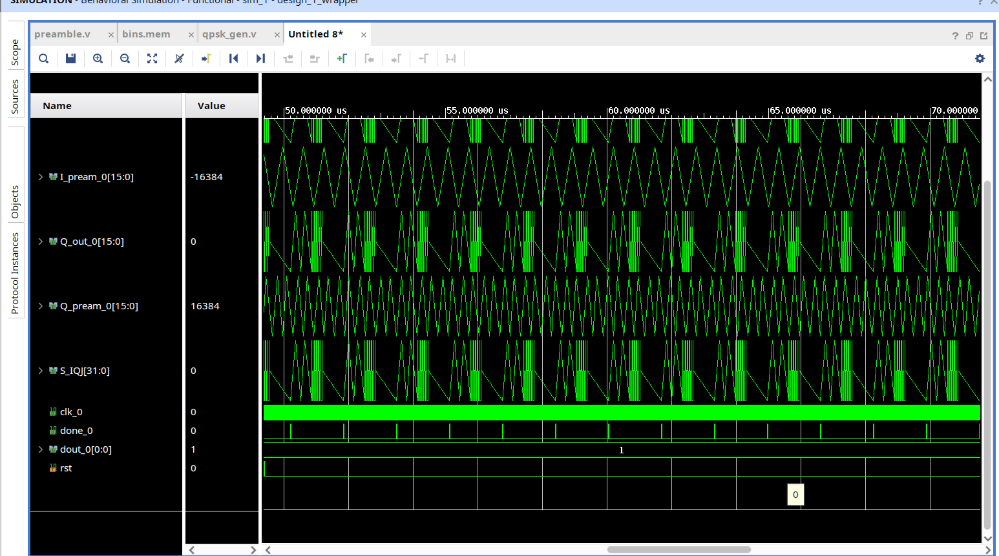

# QPSK Preamble Detection Using Correlation and RTL Implementation

## Overview

This project implements a **QPSK preamble detection** algorithm using correlation in MATLAB and successfully maps it to **RTL using Verilog** on Vivado. It simulates the generation of a preamble and payload bit sequences, combines them into a QPSK-modulated signal, detects the preamble via cross-correlation, and then demonstrates a hardware implementation.  

The approach is fundamental for synchronization, packet detection, and FPGA-based digital communication systems.

---

## Features

- MATLAB simulation of preamble detection using known I/Q sequences  
- QPSK modulation with 4-level constellation mapping  
- Payload generation with repeated bit sequences  
- Oversampled signal creation using upsampling  
- Convolution-based preamble detection  
- **RTL implementation using Verilog** on Vivado  
- RTL diagram and waveform results included  
- Plots for MATLAB signals, correlation, and constellation  

---

## Requirements

- MATLAB R2018b or later  
- Vivado Design Suite (2023.1 recommended)  
- Basic MATLAB and Verilog knowledge  

---

## MATLAB Simulation Usage

1. Open `preamble_detection.m` in MATLAB.  
2. Run the script.  
3. Observe generated plots:  
   - Correlation magnitude vs. sample index  
   - I/Q waveforms for preamble and payload  
   - QPSK constellation diagram  
   - Magnitude and phase of the combined signal  

**Example MATLAB plot:**  

---

## RTL Implementation on Vivado

- The preamble detection algorithm is implemented in **Verilog**.  
- Vivado was used to synthesize the design, generate RTL diagrams, and simulate waveform results.  
- The design is fully mapped to hardware, demonstrating the feasibility of FPGA-based preamble detection.  

**RTL Diagram:**  

**Simulation Results (Waveforms):**  

- **Result Fig 1:**  

  

- **Result Fig 2:**  

  

---

## How It Works

1. Define amplitude scaling and samples per bit (oversampling).  
2. Create known preamble bit sequences for I and Q channels, then upsample.  
3. Generate QPSK symbols using ±A levels for I and Q channels.  
4. Generate payload sequences, modulate, and upsample.  
5. Concatenate preamble and payload signals.  
6. Combine I and Q to form a complex baseband signal.  
7. Perform convolution-based correlation to detect preamble.  
8. Map the algorithm to **Verilog RTL**, simulate, and visualize waveforms.  

---

## Applications

- Wireless communication systems  
- Digital modem and receiver design  
- FPGA-based SDR systems  
- Signal synchronization and frame detection  
- Communication systems research and education  

---

## Author

**Abdul Basit**  
Electrical and Electronics Engineer | FPGA & DSP Enthusiast  
[LinkedIn Profile](https://www.linkedin.com/in/yourprofile)  
[GitHub](https://github.com/yourgithub)  

---

## License

This project is licensed under the MIT License - see the [LICENSE](LICENSE) file for details.  

---

## Contact

Feel free to reach out for questions, collaboration, or improvements!  
